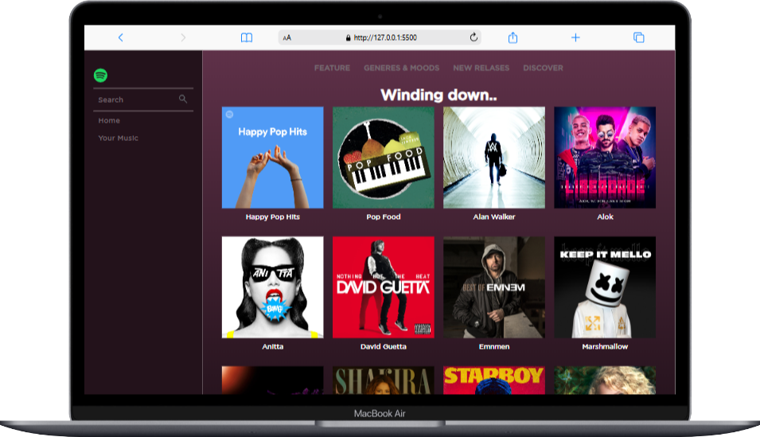

# Cópia do site spotify para fins didáticos 

O intuito deste repositório é melhorar as técnicas do HTML e CSS, no exposto, foi clonado o site do spotify para fins didáticos 

    

Site Desenvolvido em tecnologia HTML e CSS com responsividade presente em tablets e smartphone

    
[Acesse aqui](https://guime777.github.io/Replica-Spotify/)

## Site proposto: Spotify

- [x]  Estrutura HTML
- [x] Organizando arquitetura de projetos font 
    - assetes
        - img
        - fonts
- [x] Realizando primeiro commit
- [x] Estilo inicial CSS
    - CSS
        - header
        - main
        - footer
- [x] Realizando segundo commit
- [x] Enviando ao github

